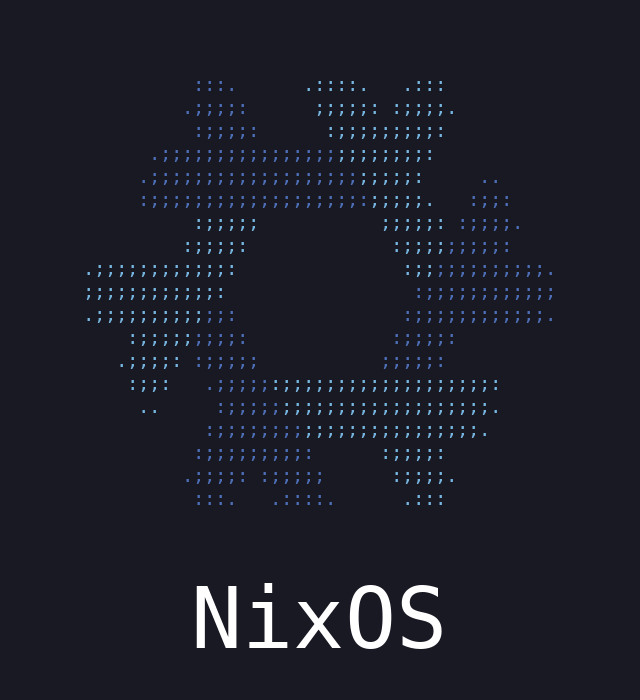

# NixOS Loading — Plymouth Theme

A Plymouth boot splash theme for NixOS. The "NixOS" wordmark appears at boot, then the 6 lambda arms of the snowflake logo are revealed one-by-one clockwise as boot progresses — forming the complete logo by the time the system is ready.

Available in 4 variants: **default** (blue gradient), **rainbow**, **white**, and **spin** — the snowflake as spinning ASCII art, for a terminal look.

## Preview

| Default (blue gradient) | Rainbow | White | Spin (ASCII) |
|:-:|:-:|:-:|:-:|
|  |  |  |  |

## Installation

### NixOS Flake (recommended)

Add as a flake input and import the module:

```nix
{
  inputs = {
    nixpkgs.url = "github:NixOS/nixpkgs/nixos-unstable";
    nixos-loading-plymouth.url = "github:qboileau/nixos-load-plymouth";
  };

  outputs = { nixpkgs, nixos-loading-plymouth, ... }: {
    nixosConfigurations.myhost = nixpkgs.lib.nixosSystem {
      modules = [
        nixos-loading-plymouth.nixosModules.default
        {
          boot.plymouth.nixos-loading.enable = true;
          # Optional: choose a variant (default is "default")
          # boot.plymouth.nixos-loading.variant = "spin"; # or "rainbow" / "white"
        }
        # ... your other modules
      ];
    };
  };
}
```

The module enables Plymouth and sets the theme automatically when `boot.plymouth.nixos-loading.enable = true`.

### Manual Package Selection

If you prefer not to use the module, you can add the theme package directly:

```nix
{
  boot.plymouth = {
    enable = true;
    theme = "nixos-loading-default"; # or "-rainbow" / "-white" / "-spin"
    themePackages = [
      nixos-loading-plymouth.packages.${pkgs.system}.nixos-loading-default
    ];
  };
}
```

## Building

```bash
# Build the default (blue gradient) theme
nix build

# Build a specific variant
nix build .#nixos-loading-rainbow
nix build .#nixos-loading-white
nix build .#nixos-loading-spin

# Generate GIF previews
nix build .#preview-default
nix build .#preview-spin

# Re-rasterize the committed frames/ PNGs
nix build .#frames-default
nix build .#frames-spin
```

Or regenerate `frames/` in place, from within `nix develop`:

```bash
./generate-frames.py            # default, rainbow, white
./generate-spin-frames.py       # spin
```

## Local Testing

```bash
nix develop  # provides rsvg-convert, imagemagick, plymouth

sudo plymouthd --tty=/dev/tty1
sudo plymouth show-splash
# wait, then:
sudo plymouth quit
```

## How It Works

1. **Variants**: `variants.json` is the single source of truth — source SVG, animation style, frame count, animation speed. The flake, the generators and `test-plymouth.sh` all read it
2. **Frames**: every variant ships pre-composed PNGs in `frames/<variant>/`, so packaging needs no SVG tooling. `generate-frames.py` splits a logo SVG into its 6 lambda arms plus the wordmark and rasterizes them with `rsvg-convert` (lambdas at 512 px, text at 256 px); `generate-spin-frames.py` instead rasterizes the *rotated* arm geometry into a character grid and draws it with a monospace font, one frame per angle
3. **Animation**: the Plymouth script cycles through the frames on every refresh tick. The reveal variants fade each lambda arm in one-by-one (clockwise from top-left: 120° → 180° → 240° → 300° → 0° → 60°) then back out; the spin variant turns the whole snowflake. Its 36 frames span 120°, which is a full period — the arms' colors repeat every 120° — so the loop is seamless
4. **Password prompt** (LUKS): displays the full logo with `●` bullet-masked input
5. **Layout**: geometry is re-read from `Window.Get*` on every refresh tick, never cached — Plymouth rebuilds its virtual canvas (and re-centers each display in it) whenever a monitor is added, removed or changes mode, so cached coordinates would leave the logo offset on every screen

## License

MIT